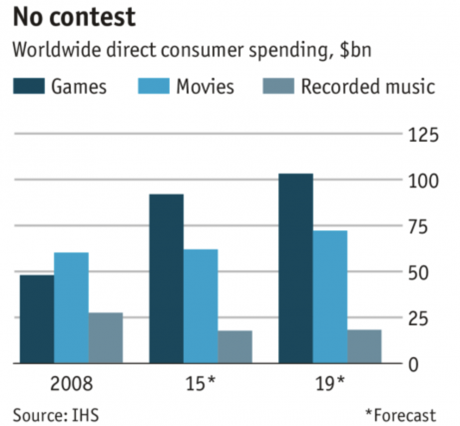
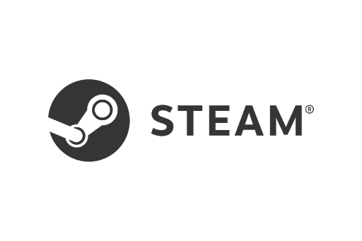
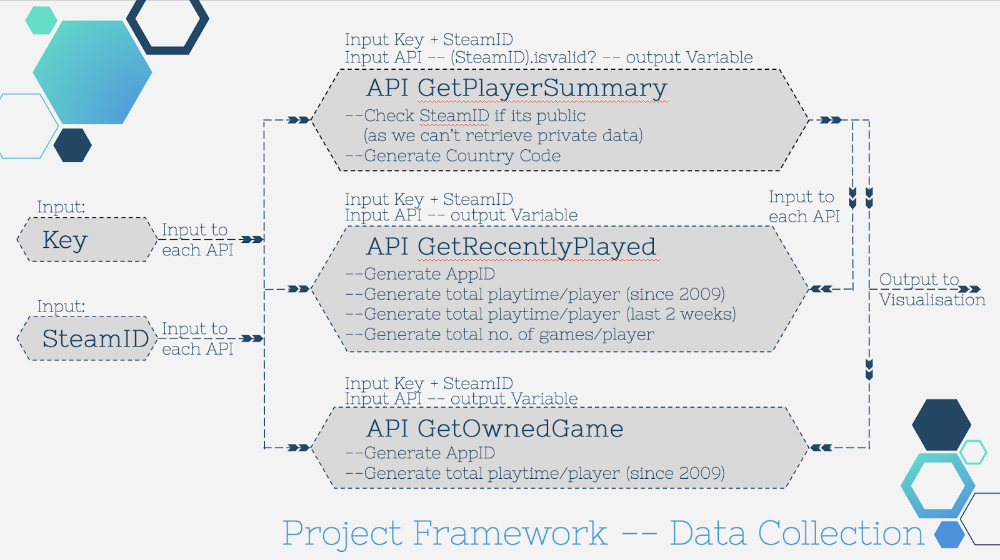

# Steam Online Game
## Introduction - Online Game Industry
For the past decade, the shift from physical to digital has been very disruptive to music, and movies, and more so the gaming industry. Video game industry is silently taking over the entertainment world. There was a time when brothers are fighting for one console to top each other’s score on Tetris in Gameboy. Today we have E-sports tournaments which take the form of multiplayer video game competitions between teams of professional gamers.

Gone are the days when gaming was an activity to pass the time. The game culture has grown out of its niche community, which brings different perspectives in profit-generating channels from merchandising to live events, streaming services, online advertising, and brand endorsement; literally taking the game to the center stage with a global audience1.

With two major catalysts 1) *the network effect* and 2) *the fast network* which made streaming game services feasible, video game industry has easily outpaced their contemporaries in the film and music industry, with below graph showing direct consumer spending as the highest within the gaming sector.

<p align="center"></p>

### Imaginary Client
We have been approached by a company hoping to understand the online game market via Steam. We will provide the findings to inform decisions about **1. _game/genre preference per country_ , 2. _game addictive variable based on time factor_ , 3. _game popularity_**.

### Business Value
Video games market is worth more than music and movies combined so why aren’t more developers or even Tech Giants focused on launching games services? The online game model provides social interaction, popularity, and additivity with time factors. These are key drivers for value generation. We will look into the dataset to identify patterns and trends to assist business decisions.

### Project Goal
The motivation of this project is to retrieve, process and analyse data via Steam Get API. Ultimately sharing our insights and suggestions to add business value.

### Dataset-Steam API
Steam is the ultimate destination for playing, discussing, and creating games. To date, it has 32,000 total games with 26 million users. Our suggestion is with its large users database, it is an under tapped industry with a huge raw database to inform valuable decisions.

<p align="center"></p>

## Data Collection Strategy
In general, we source for the key and SteamID, input into *3 APIs* and generate userdata for data analysis and visualisation. 

<p align="center"></p>

### Coding
1. Generating valid steamID
   - In order to generate sufficient valid Ids for analysis, which should represent public users that contain location information, we create a helper function named              *“GetPlayerSummaries”*.
```
def GetPlayerSummaries(steamId):
    steamId = str(steamId)
    params = {
        "steamids" : steamId
    }
    try:
        url = requests.get("https://api.steampowered.com/ISteamUser/GetPlayerSummaries/v2/?key=72797CA67785C46C4DDB70C6F4C295D3&format=json" ,params=params)
        data = json.loads(url.text)
        if data["response"]["players"][0]["loccountrycode"] is not None:
            return True
        else:
            return False
    except:
        return False
```
- This function will return boolean value given a particular steamId, if return True, we will add that particular steamId to a list and ultimately save the steamIds in that list to a txt document.

We define another function named “steamid_to_64bit” that will change "STEAM_X:Y:Z" format into 64 bits format, which is more convenient for further analysis. Details about patterns of steamIds can click <a href="https://developer.valvesoftware.com/wiki/SteamID" target="_blank">Steam ID</a>:


